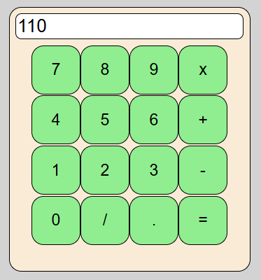

# Calculador

- Iniciado 22/03/2025, 15h.
- Criada inteiramente com JavaScript.
- Projeto Pessoal.
- Manipulação de Array, chegando ao resultado
  com um processo sequencial de resoluções da equação
  24/02/2025:
- Criação de banco de dados e conexão com SQLSERVEREXPRESS.

A fazer:
- criar a API com o banco de dados
- criar botao que limpe o imput e o array.
